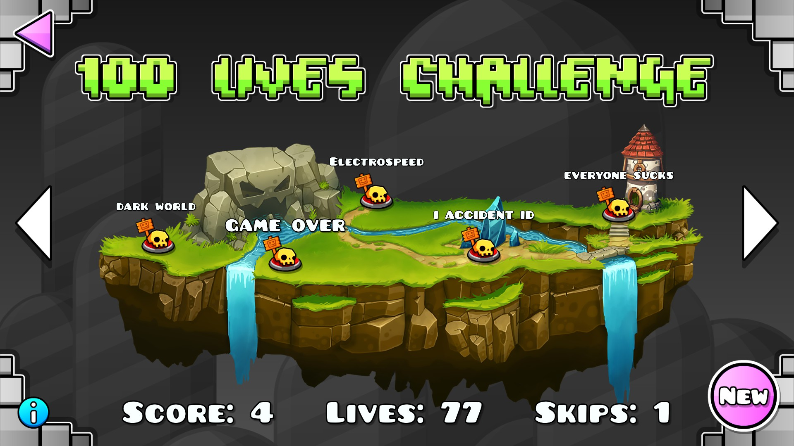

# Geometry Dash 100 Lives Challenge

This mod introduces a new interface for the Recent Tab 100 Lives Challenge.

## Features

- A new button in the level search screen that opens the 100 lives challenge menu.
- 100 random levels to play through from the recent tab.
- Automatic score, life, and skip tracking:
  - Players have 100 lives and 3 skips at the start of each run.
  - Each completed level increases the score by 1.
  - Each death in both normal and practice mode costs a life.
  - Each coin collected during a level completion rewards the player with an extra life.
  - If a level cannot be downloaded for whatever reason, a free skip is awarded to the player.
  - When the player runs out of lives, the player is free to play any level in the run.

## Gallery

## Notes

- If a level is not saved (i.e. deleted from saved levels or could not be downloaded initially), and the level cannot be downloaded after exiting and re-entering the game, the run will be reset!
  - The run score will still be saved.
