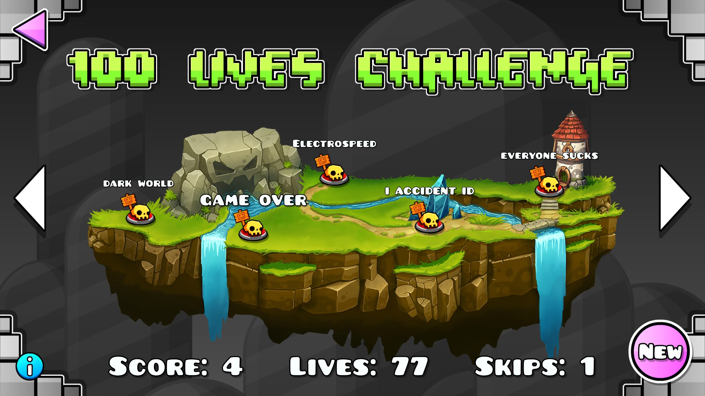

# Geometry Dash 100 Lives Challenge

<cr>100 levels, 100 lives, how far can you get?</c>

This mod introduces a new interface for the Recent Tab 100 Lives Challenge.

## Features

- A new button in the level search screen that opens the challenge menu.
- 100 random levels to play through from the recent tab.
- Automatic score, life, and skip tracking:
  - Players have 100 lives, 3 skips, and 3 practice runs at the start of each run.
  - Each completed level increases the score by 1.
  - Each death in normal costs a life.
  - Deaths in practice runs are not penalised.
  - Each coin collected during a level completion rewards the player with an extra life.
  - Collecting all 3 coins in a level grants the player an extra skip or practice run.
  - If a level cannot be downloaded for whatever reason, a free skip is awarded to the player.
    - However, if a level is physically impossible, no free skip is awarded and a skip will be consumed.
    - This is to prevent abuse of giving yourself free skips.
  - When the player runs out of lives, the player is free to play any level in the run.

## Gallery

## Notes

- If a level is not saved (i.e. deleted from saved levels or could not be downloaded initially), and the level cannot be downloaded after exiting and re-entering the game, the run will be reset!
  - The run score will still be saved.

## Contributing
Not accepting contributions as of now.
